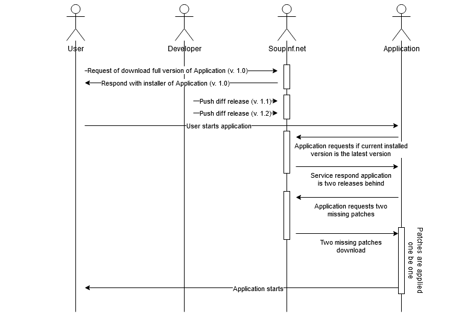
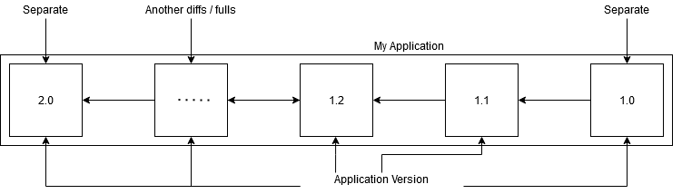
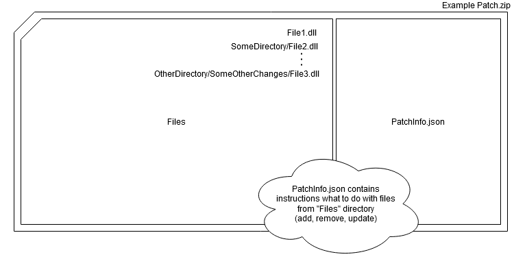
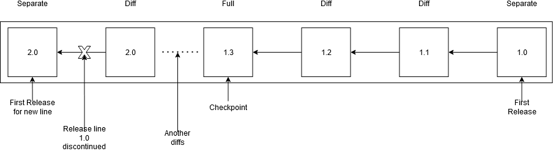

# High level overview of how the update process is performed

To consider how simple update process might looks like, let's look at the image below



This is not the only possible strategy to use but the most obvious so let's follow that and describe what happens here. For the beginning let's assume that the developer released application in version 1.0. The developer placed a link on his page to download installer of his application. User has installed this application. After some time user would like to use the application again but the developer already released two minor versions (1.1 and 1.2). User clicks the application icon, what happens?

1. Operating system loads the application and starts preparation to run it.
2. `Application starts*`
3. Application determine whether version it is (it is in version 1.0)
4. Application asks Soupinf.net is there any newer version from the version the application currently is.
5. Server respond to application that the developer released two minor versions (1.1 and 1.2)
6. Application starts downloading those two minor versions.
7. After patches are downloaded, application `somehow**` apply the patches itself.
8. Application continue to working with updated version.

> \* I doesn't necessarily mean that it is the same application as user requested! Your may present your user icon that leads to updater application instead of the real one. This allows your updater to do the hard work and launch an application after process finishes without locks.

> ** It might be tricky. Generally speaking self updating of an application might require to use external application to perform the update or if we likes to use tricks we might using invariant program that loads the destination program and do the update before invariant program will load our application and starts performing it. We have to think of many details how the operating system will uses our files, when they will be loaded, what makes them locked by the operating system. All of that might cause we will chose one or another way of updating our application.

# Basic concepts

Before you starts hacking, we would like to introduce major concepts we uses in our platform. We will talk about four concepts (version, package, separate release, full release, diff release) that describe most of the architectural patterns we followed. Based on that you will fully understand what to expect with using our product. 

**Package** - Program or module, regardless of what 

**Version** - Your package is about to being met in some specific version. For example you might release your software in version number `1.0` and then increase it to `1.1
`. It means that your package occurs in two version 1.0 and 1.1 which probably has different features.

**Release line** - A single release line takes from separate release to another separate release (excludingly).



**Separate release** - When you discontinue current release line (ie. you end up supporting version 1.0 and starts supporting version 2.0) and doesn't want your users to being able to upgrade applicatioon automatically. This is also usefull when you do the first release of your application.

**Full release** - When you release newer version of your software and would like your users to receive patch with version features / bugfixes. Also this is usefull when you would like new users to download full version of your software without having to apply patch from the begining. You may call it checkpoint.

**Diff release** - When you release newer version of your software and would like your users to receive patch with version features / bugfixes. This has the smallest storage footprint.

# How does the patch looks like

We are going to use the image below as our reference image to dig deeper later. Please, see this image and continue reading below.



When you do the release, regardless of whatever of type of release it is, your are generating a patch. Patch is a file that contains instructions how to transform your application from a version `X` to version `Y`. Later on, we will discuss it with an example but now, let's start our journey with trying to understand what `PatchInfo.json` is. Below is a small example:

```
{
   "Diffs": [
   {
     "SourceRelativePathToFile": "SomeFile.dll",
     "DestinationRelativePathToFile": null,
     "State": 2
   },
   ...
   ],
   "Version": "0.0.1.0"
}
```

As you see, it's raw `json` file. This file specify what kind of operations on the destination application are required to perform transformation from one version to another. In fact it is diff result of **previous** and **current** version. It's worth to note that as it's property name states it contains relative path to the modified file as you would modify one of dependencies from the deeper folder (based on the application root). What we store in this file is the information whether the file should be `UPDATED`, `DELETED` or `ADDED`. This is also what updater have to do, take `PatchInfo.json` and process instructions one by one with applying changes to destination folder.

Let's consider our application in version 1.0 contains such files:

```
Library_01.dll
Library_02.dll
MyApplication.exe
Dependencies/Library_03.dll
```

Then, you would like to release version 1.1 and after the whole development process you resigned from the usage of `Library_01.dll` but you had to add `Library_03.dll`. You have also added new dependency `Library_05.dll` to your folder `Dependencies` as the new feature you implemented requires that. Destination application folder you would like to achieve is:

```
Library_02.dll
Library_03.dll
MyApplication.exe
Dependencies/Library_03.dll
Dependencies/Library_05.dll
```

so what your patch will represent is the difference between those two folders. Let's visualize it:

```
Library_01.dll - REMOVE
Library_03.dll - ADD
MyApplication.exe - UPDATE
Dependencies/Library_05.dll - ADD
```

This patch will be sent out to server and as soon as the client application will ask about that file, it will be served for the client. Generation and the process of sending result to storage is what does the **patcher** do. Patch generation is fully automated with taking a consideration that to do the comparsion you have to compare it with the newest version stored on server. We will speak about the patcher program a bit later in the different section.

Good that you don't have to code all this yourself.

# Natural flow of releases

This time, we will speak about what kind of updates you might chose and when to use them. There are three types of updates:

**Separate** - When you do the first release, you must use it! Or you would like discontinue current release line. This means that when you finish supporting version 1.0 and decide to release line 2.0 you might not want for your users to be able to update to version 2.0. What reasons would convince you to do that?

1. You have introduced some major changes that disallow to successfully update from one version to another.
2. You just don't want to develop this release line any more.
3. You would like to change your business model and charge your users for the application usage from the next release line.

... many more

**Full** - Release with checkpoint. When you would like your users to be able to download the installer for this version. Also this version allows users with previous version to transform their applications to releasing one.

**Diff** - This releases the patch transforming from one version to another only.

The best when we work on application features is to publish diff frequently. This should result with a small footprint for end user and makes the users works with the newest version of application for the most of time. Let's look at the proposition of how release model should looks like for the most of applications



So we basically pushed application in version `1.0` which was separate release as it was the first publish ever. Then, the longer the development took, the more differential versions were published (`1.1` and `1.2`). After few more changes we decided that we introduced so big changes that it would be worth for new users to download installer for version `1.3` and in the same time to allow users with version `1.2` transform to `1.3` so we chose full release type. The we have introduced few more small updates that ends up with more differential publishes to finally end up support of release line `1.0`. We introduced then separate `2.0` publish that discontinued working over `1.0`. 
